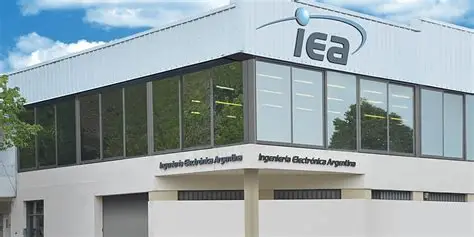
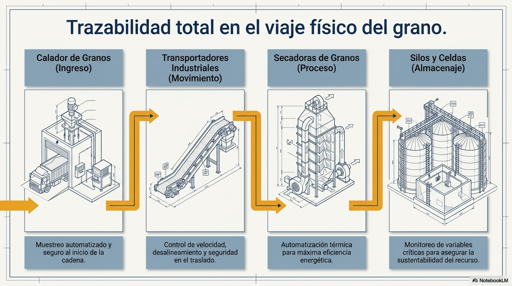
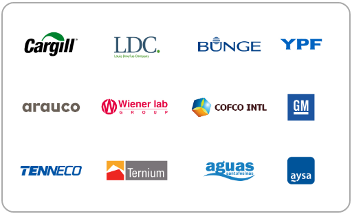
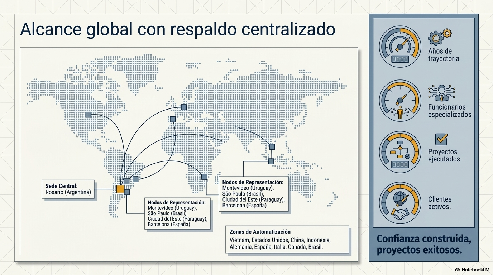
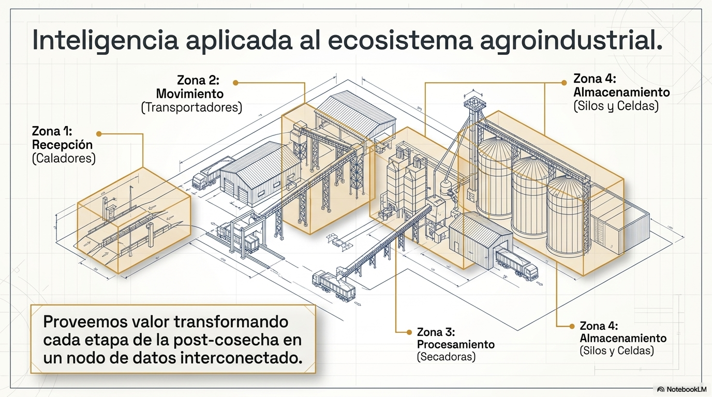
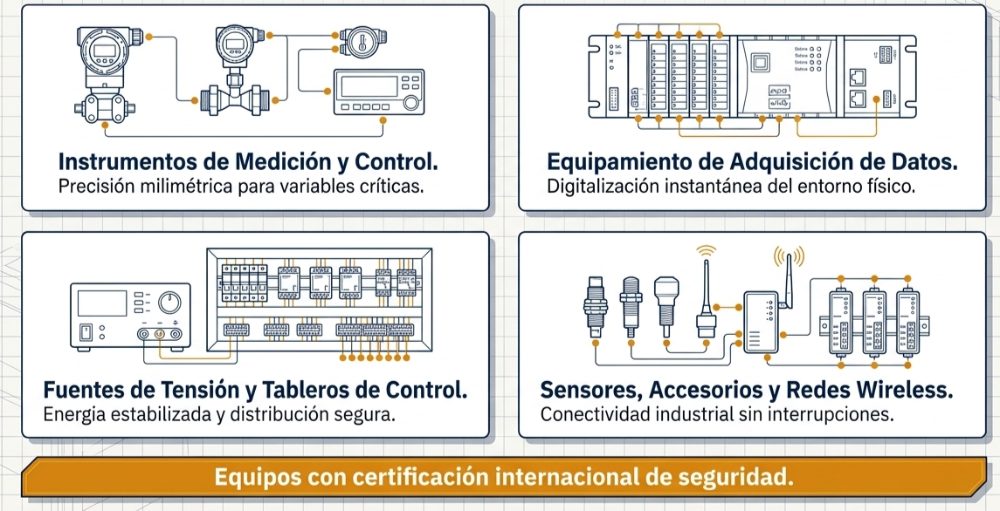

# IEA 
Desde su fundación en 1978, Ingeniería Electrónica Argentina ha estado implementando soluciones de automatización industrial que integran procesos y optimizan la eficiencia energética. 

Se enfoca en I4.0 y IIoT, lo que impulsa el desarrollo de software industrial, asegurando la conectividad y la seguridad en todos sus proyectos globalmente.

IEA busca **crear soluciones** que ayuden a las industrias a mejorar sus procesos mediante la *automatización* de los mismos, para ello cuenta con equipos multidisiplinarios, los cuales diseñan y fabrican productos electrónicos como controladores, indicadores, adquisidores de datos, como asi tambien tableros, medidores, sensores y mas. Cuenta con un area de desarrollo e ingenieria que diseña e implementa software industrial para manejar diversos procesos y conexiones entre , con más de **10000** proyectos, se destaca tanto en el mercado local como en el internacional.

Promueve la sostenibilidad y el bien social con proyectos que, además de mejorar la eficiencia, tienen un impacto positivo en las comunidades y el medio ambiente, con el uso responsable de recursos, la implementación de tecnologías verdes y el impulso de la seguridad en el trabajo.

> La ingeniería y la ejecución de los sistemas provistos por IEA cumplen con las condiciones de las normas internacionales ISO 9001, en curso de certificación, manteniendo una permanente actualización de los procesos y técnicas empleados.

## SOLUCIONES
Proporciona soluciones que incluyen

* **Hardware personalizado**: Crean los diseños y fabrican el hardware adecuado según las necesidades de los procesos de cada cliente.

* **Automatización**: Sus proyectos ayudan a minimizar la participación humana para maximizar la eficiencia y rapidez de los procesos, minimizando, además, el riesgo para los trabajadores.

* **Software**: Crean e implementan el software que utilizan sus productos con una prueba de calidad adecuada para garantizar su correcto funcionamiento y eficiencia.

* **Mantenimiento**: Ofrece la posibilidad de contratar un servicio de diagnóstico, mantenimiento y soporte técnico para sus equipos 24x365.

## CLIENTES 
La empresa actualmente lidera innovaciones y proyectos en puertos, plantas de molienda y almacenamiento de granos

Integra soluciones de empresas como *Siemems*, *Rockwell* y *Schneider Electric*, siendo esta ultima la primer Alliance Partner Schneider Electric en la region Sudamericana.

Proveen servicios a clientes como Bunge, Cargill, Cofco, AFA, General Motors, YPF y Aguas Santafesinas, con *1250 clientes totales* 

## CERTIFICACIONES

* AVEVA integrator (2006)

* Process Control PCS-7 Siemens (2024)

* Rockwell Solution Provider Plant PAX (En proceso)

* Phoenix Contact SP

* TÜV Functional Safety for Process Industry IEC 61511 / 
61508

* ISO 9001 : 2015 para Servicios de Contratos de 
Mantenimiento de Ingeniería

* Belden: Hirschmann Industrial Ethernet Specialist (HIES – 2023)

* PI OSIsoft sistem integrator (En proceso)

* GE Digital iFix Solution Provider (En proceso)

## ALCANCE
La sede principal se encuentra en **Rosario** (Av. Eva Perón 4468) 

Poseen representación comercial en **Montevideo** (Uruguay), **San Pablo** (Brasil), **Ciudad del Este** (Paraguay) y **Barcelona** (España), habiendo participado en proyectos alrededor del mundo, en *Asia*, *Norteamérica* y *Europa*

---
## PROYECTOS Y APLICACIONES DESTACADOS

* GrainVision (software de termometria de granos almacenados)
* Co2ntrol (deteccion temprana de Co2 en grano almacenado)
* Calador Automatico
* [otros grandes proyectos](https://www.iea.com.ar/proyectos/)

---
## PRODUCTOS Y SISTEMAS

IEA maneja la producción y venta de una gran variedad de productos electrónicos como:
* [Equipos de obtención de datos](https://www.iea.com.ar/categoria-producto/equipamiento-de-adquisicion-de-datos/)

* [Fuentes de tensión](https://www.iea.com.ar/categoria-producto/fuentes-de-tension/)

* [Instrumentos de medicion y control](https://www.iea.com.ar/categoria-producto/instrumentos-de-medicion-y-control/)

* [Sensores, transmisores y transductores](https://www.iea.com.ar/categoria-producto/sensores-accesorios/sensores/)

* [Accesorios](https://www.iea.com.ar/categoria-producto/sensores-accesorios/)

* Equipos de radioenlace y redes de comunicación.

* PLC  y sistemas de control distribuido.

* RTU / Unidad Terminal Remota.

* Sistemas SCADA.

* Controles y aplicaciones especiales.

* Consolas y tableros de control, tableros de CCM y distribución.

* Analizadores en línea para diversos tipos de procesos.

---
## PAGINA
Para mas informacion, puedes visitar [Ingenieria Electrónica Argentina](https://www.iea.com.ar/)